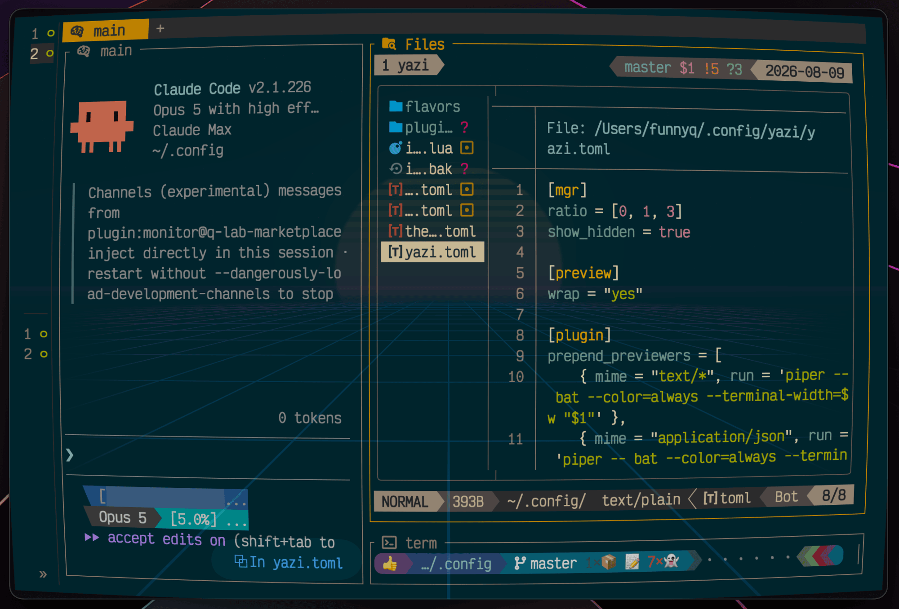

# yazi-claude-ide

Yazi plugin that speaks Claude Code's `/ide` protocol, so Claude Code can pull context (currently focused/selected file) from [yazi](https://yazi-rs.github.io/) the same way it does from VS Code or Neovim.



The sidecar is a single compiled Rust binary.

## Setup

The plugin and the sidecar binary it launches install separately.

**1. The plugin.**

```sh
ya pkg add FunnyQ/yazi-claude-ide:claude-ide
```

**2. The sidecar.**

```sh
curl -sSL https://raw.githubusercontent.com/FunnyQ/yazi-claude-ide/main/install.sh | bash
```

That puts the latest release in `~/.local/bin`; set `YCI_INSTALL_DIR` to choose
somewhere else. Prebuilt binaries cover macOS arm64, Linux x86_64, and Linux
arm64 — the Linux builds are statically linked against musl and need no system
libraries. On any other platform — or if you would rather read the source than
pipe it to a shell — build it:

```sh
cargo install --root ~/.local --git https://github.com/FunnyQ/yazi-claude-ide
```

`--root ~/.local` lands the binary in the same `~/.local/bin` the script uses.
Without it cargo installs to `~/.cargo/bin`, and if both copies exist, whichever
directory comes first on your `PATH` wins — cargo will report success while yazi
keeps forking the other one. Upgrading is the same command; `install.sh` warns
when it finds a copy shadowing the one it just wrote.

**3. The config**, in `~/.config/yazi/`:

```lua
-- init.lua
require("claude-ide"):setup()
```

```toml
# keymap.toml — sends the marked files to Claude as @-mentions
[[mgr.prepend_keymap]]
on = ["c", "v"]
run = "plugin claude-ide"
desc = "Send the marked files to Claude"
```

Start yazi, then run `claude` in another pane — it finds the sidecar on its own.
Verified against Claude Code 2.1.226; the `/ide` protocol has no published
specification, so a newer CLI can change what it expects without notice.

Two channels, and they do different things:

- **Moving the cursor** tells Claude *which file you are looking at* — the path
  alone, no keypress, no contents.
- **Pressing `cv`** says *look at these*. Mark things with `space`, press `cv`,
  and each arrives as an `@` mention; submitting the prompt makes Claude read a
  file and list a directory. With nothing marked it sends whatever the cursor
  sits on, folders included.

The plugin never reads a file itself. Claude does, when you submit.

## Line ranges from your editor

A file manager has no line numbers, so neither channel above can send one. The
editor yazi opens on `Enter` does, and it can hand the range back through the
same sidecar — one `/ide` connection still covers both halves.

Bind this in Neovim. It only binds inside a yazi-opened editor, and it sends
line numbers, never the selected text:

```lua
-- ~/.config/nvim/lua/plugins/yazi-claude-ide.lua (or anywhere in your config)
if vim.env.YAZI_ID then
  vim.keymap.set("v", "<leader>ay", function()
    local first, last = vim.fn.line("v"), vim.fn.line(".")
    if first > last then
      first, last = last, first
    end
    vim.system({
      "ya", "pub-to", "0", "claude-selection", "--json",
      vim.json.encode({
        yaziId = vim.env.YAZI_ID,
        url = vim.fn.expand("%:p"),
        lineStart = first,
        lineEnd = last,
      }),
    })
  end, { desc = "Send the selected lines to Claude" })
end
```

Select lines, press `<leader>ay`, and the range arrives as a line-anchored `@`
mention — `@file#L10-20` for lines 10 to 20.

Any editor works the same way — publish that JSON with `ya pub-to 0
claude-selection` and count lines from 1. `yaziId` is what routes it: the
publish is a broadcast that reaches every sidecar on the machine, and each one
keeps only the ranges carrying its own `$YAZI_ID`, which your editor inherited
from the yazi that opened it.

## Two yazi instances in one repository

**Claude Code cannot pick between them, and this plugin cannot make it.** The
CLI adopts an IDE by matching a lock file's `workspaceFolders` against the
session's working directory, and it connects without asking only when exactly
one lock file matches. Two yazi instances open on the same repository both
advertise that repository, so both match and `/ide` shows a picker. Nothing the
sidecar writes changes this: it cannot know which session will connect, and the
lock file has no field for *serve only this pane*. A fix would have to happen in
the CLI.

What is fixable is telling the rows apart, since both otherwise read `yazi`
followed by the same repository path. Name the panes:

```sh
export YCI_IDE_LABEL=api      # in one pane's yazi
export YCI_IDE_LABEL=web      # in the other's
```

The rows become `yazi (api)` and `yazi (web)`. Any string works. The sidecar
reads this one variable and nothing else, so if your terminal or multiplexer
exports a per-pane identifier you can forward that instead —
`YCI_IDE_LABEL="$TMUX_PANE"` — and read the same variable in the pane you are
typing in to know which row is yours. Unset or blank, the name stays `yazi`.

The picker also ticks the connection the session already holds, which answers
the same question whenever the rows are distinguishable at all.

## Development

```sh
cargo test
cargo clippy --all-targets -- -D warnings
cargo fmt --check
dev/manual/harness.sh verify                # the clauses only a real yazi can show
```

[`dev/docs/contract.md`](dev/docs/contract.md) is the specification. Every
automated test is named after the clause it covers, so `a5_server_binds_loopback_only`
answers to clause A5. Change behaviour by changing the clause first.

[`dev/docs/baseline.md`](dev/docs/baseline.md) and
[`dev/docs/yazi-capability.md`](dev/docs/yazi-capability.md) record the
measurements the clauses rest on. `dev/spike/` holds the tools that took them;
they run on bun and are not part of the build.

## License

MIT. See [LICENSE](LICENSE).
